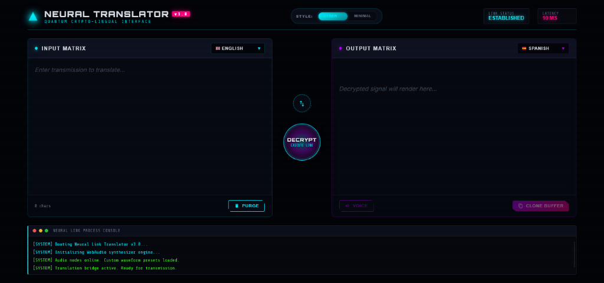
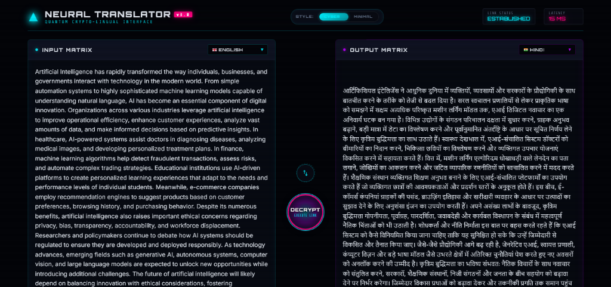

<div align="center">

# 🌐 LINGUAVERSE

### AI-Powered Neural Translation Tool — Dual Cyber HUD & Minimalist Interface

[](https://html.spec.whatwg.org/)
[](https://www.w3.org/Style/CSS/)
[](https://developer.mozilla.org/en-US/docs/Web/JavaScript)
[](https://developer.mozilla.org/en-US/docs/Web/API/Web_Audio_API)
[](https://developer.mozilla.org/en-US/docs/Web/API/Web_Speech_API)
[](LICENSE)

<br/>

> **LinguaVerse** is a client-side neural translation platform featuring a customizable interface. Switch between a high-tech **Cyberpunk HUD** (equipped with synthesized audio cues, progress dials, and real-time terminal logs) and a sleek **Minimalist Layout** (designed with flag-adorned select dropdowns and a lightning-fast translate deck).

<br/>

   

</div>

---

## 📋 Table of Contents

- [Overview](#-overview)
- [Application Preview](#-application-preview)
- [Features](#-features)
- [Architecture](#-architecture)
- [Tech Stack](#-tech-stack)
- [Project Structure](#-project-structure)
- [Installation](#-installation)
- [Usage](#-usage)
- [Interactive Controls & Shortcuts](#-interactive-controls--shortcuts)
- [Configuration](#-configuration)
- [Design Decisions](#-design-decisions)
- [License](#-license)

---

## 🧠 Overview

LinguaVerse bridges language barriers client-side, offering dual interfaces for varying preferences. The primary **Cyber HUD** offers terminal-style logs, system alerts, audio ticks, and hologram scanlines, while the **Minimal Mode** offers a modern, distraction-free environment resembling enterprise AI translation hubs. 

By default, the application runs entirely in-browser, performing secure HTTP handshakes with translation node APIs without requiring secret keys.

---

## 🖼️ Application Preview

### 1) Cyber HUD Mode
A cybernetic dashboard displaying system telemetry, real-time logging, a central spinning progress indicator, scanlines, and glow indicators.

#### System Initializing & Idle State


#### Translation Decryption Stream Active


### 2) Minimalist Theme
A clean layout with flag icons, centered controls, a vertical splitter, and inline purple action triggers.

---

## ✨ Features

| Feature | Description |
|---|---|
| 🌌 **Dual-Theme Design** | Switch between a high-tech Cyberpunk interface and a modern Minimalist design via a sliding header toggle |
| 📡 **Multi-Node Translation** | Uses Google Translate `gtx` client-side API as primary node, and MyMemory API as secondary backup fallback |
| 🟢 **Cypher Decryption Stream** | Displays translation results using a simulated character-by-character matrix decoding animation |
| 🔊 **Web Audio Synthesizer** | Dynamically synthesizes cybernetic click sounds, decryption ticks, and ascending chime chords |
| 🗣️ **Native Vocal Synthesis** | Integrated Text-to-Speech (TTS) that reads out decrypted buffers in the native accent of the target language |
| 📋 **Buffer Cloning** | Copies output results to the local clipboard with instant validation feedback ("CLONED!") |
| ⌨️ **Keyboard Hotkeys** | Support for `Ctrl + Enter` shortcut to execute translation immediately from the input panel |
| 🌐 **Telemetry Terminal** | A scrolling, color-coded console logging handshake progress, language auto-detection, and node statuses |

---

## 🏗️ Architecture

```
┌────────────────────────────────────────────────────────────────────────┐
│                        User Interface Controller                       │
│                                                                        │
│  [Theme Toggle] ──► Switches CSS Class (.theme-minimal) on Body        │
│  [Source Input] ──► Updates Character Counter + Fires Synthesis Click   │
│  [Decrypt Click] ──► Triggers Translation Pipeline                     │
└───────────────────────────────────┬────────────────────────────────────┘
                                    │
                                    ▼
┌────────────────────────────────────────────────────────────────────────┐
│                      Neural Translation Engine                         │
│                                                                        │
│  1. Check Primary Node  ──► fetch(Google Translate gtx Endpoint)        │
│  2. Fail Safe Fallback  ──► fetch(MyMemory Public Translation API)     │
│  3. Auto Detection      ──► Reports detected language code to log      │
└───────────────────────────────────┬────────────────────────────────────┘
                                    │
                                    ▼
┌────────────────────────────────────────────────────────────────────────┐
│                         Decryption Renderer                            │
│                                                                        │
│  Matrix Stream: Output cycles random cypher glyphs [0,1,X,Δ,Ψ,Ω,§,%...]  │
│  Web Audio Sync: Emits high-frequency synthesis ticks during typing    │
│  Final Sweep: Triggers dual-oscillator chime chord upon completion     │
└───────────────────────────────────┬────────────────────────────────────┘
                                    │
                         ┌──────────┴──────────┐
                         ▼                     ▼
             ┌───────────────────────┐   ┌───────────────────────┐
             │  Web Speech Synthesis │   │ Clipboard Copy Buffer │
             │  (Speaking Accents)   │   │  (Success Feedback)   │
             └───────────────────────┘   └───────────────────────┘
```

---

## 🛠️ Tech Stack

| Layer | Technology |
|---|---|
| **Core Structure** | HTML5 (Semantic elements) |
| **Theme & Style** | CSS3 (Custom properties, grid, flexbox, glassmorphism, animations) |
| **Logic Engine** | Vanilla JavaScript (ES6 Modules, DOM shifting, Event Listeners) |
| **Audio Synthesizer** | Web Audio API (`AudioContext`, OscillatorNode, GainNode, BiquadFilterNode) |
| **Speech Engine** | Web Speech Synthesis API (`SpeechSynthesisUtterance`) |
| **Translation Nodes** | Google Translate `gtx` API & MyMemory Translation API |
| **Typography** | Orbitron (HUD headers), Share Tech Mono (Console), Inter (Clean texts) |

---

## 📁 Project Structure

```
CodeAlpha_Language_Translation_Tool/
│
├── index.html       # Application entry point, SVG assets, and UI layout structure
├── index.css        # Responsive layouts, animations, neon effects, and theme styles
├── index.js         # Audio synth engine, canvas, translation caller, and decrypter
├── README.md        # Documentation and walkthrough guide
└── LICENSE          # License details
```

---

## 🚀 Installation

### 1) Clone the Repository
```bash
git clone https://github.com/crastatelvin/CodeAlpha_Language_Translation_Tool.git
cd CodeAlpha_Language_Translation_Tool
```

### 2) Serve the Application Locally
Since the application performs client-side fetches, run a local HTTP server to prevent any CORS issues.

**Using Python:**
```bash
python -m http.server 8000
```

**Using Node.js (via npx):**
```bash
npx http-server -p 8000
```

### 3) Launch
Open your web browser and navigate to:
**[http://localhost:8000](http://localhost:8000)**

---

## 💻 Usage

1. **Select Translation Path**: Set the source and target languages using the custom dropdown selectors. Select `Auto-Detect` on the source to let the engine determine your input language.
2. **Input Text**: Enter your transmission text into the left pane.
3. **Execute Link**: Click **DECRYPT** (in Cyber mode) or **Translate** (in Minimal mode), or press `Ctrl + Enter`.
4. **Read Output**: Watch the cyphertext characters animate and resolve into the final translation.
5. **Additional Actions**:
   - Click **VOICE** to listen to the translation spoken with a native accent.
   - Click **CLONE BUFFER** to copy the final translation into your clipboard.

---

## 📡 Interactive Controls & Shortcuts

| Action | Control Element | Hotkey |
|---|---|---|
| **Execute Translation** | `DECRYPT` / `Translate` button | `Ctrl + Enter` |
| **Clear Buffers** | `PURGE` button / text wipe | - |
| **Invert Languages** | `⇆` Swap button / central hub | - |
| **Theme Selection** | Header Style slider toggle | - |
| **Synthesize Speech** | `VOICE` button | - |
| **Copy Translation** | `CLONE BUFFER` button | - |

---

## ⚙️ Configuration

You can customize the script parameters inside `index.js` to modify the system settings:

- **Adjust Decryption Speed**: Locate the `speed` variable inside `streamDecrypt()`:
  ```js
  const speed = Math.max(3, Math.min(30, Math.floor(1500 / totalLength))); // modify calculation to speed up/down
  ```
- **Change Click Sound Pitch**: Locate `playClickSound()` and alter oscillator values:
  ```js
  osc.frequency.setValueAtTime(120, audioCtx.currentTime); // modify frequency (Hz)
  ```
- **Faint Grid Animation**: Hide grid background in minimal mode by modifying the CSS `opacity` of `#gridCanvas` inside `index.css`.

---

## 🧭 Design Decisions

- **Web Audio Synthesis**: We dynamically generate audio waveforms instead of loading WAV/MP3 files. This guarantees 0ms latency, zero host asset dependencies, and keeps the page loading instantly.
- **Dynamic DOM Shifting**: Rather than maintaining duplicate language select menus and synchronization listeners, JS shifts the `<select>` nodes directly between headers depending on the active layout, preserving all event bindings.
- **Fallback Bridging**: Translators often fail due to client CORS restrictions. Using Google Translate's gtx parameter serves as a robust client-side caller, with MyMemory as a secondary option.

---

## License

This project is licensed under the MIT License. See [LICENSE](./LICENSE).

<div align="center">
Built by Telvin Crasta · Production-Ready · Live Today

⭐ If LinguaVerse helped you translate signal packets faster, star the repo.
</div>
